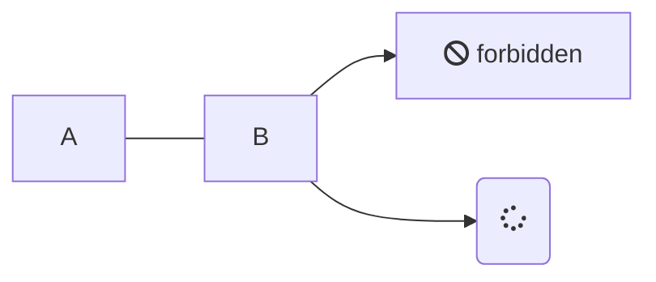

# Como usar esta Wiki

Aquí puedes encontrar una guía rápida de todas las posibilidades que ofrece Docsify como software de Wikis.

Para mayor facilidad, hemos preparado una serie de ejemplos de forma que contribuir a la misma sea tan fácil como copiar (y modificar) y pegar.

## Ejemplos

A continuación se muestran varios ejemplos de lo que podemos añadir con Markdown dentro de la wiki, junto con su implementación.

### Paneles

<!--panels:start-->

<!--div:title-panel-->

  (...) - Awesome title

<!--div:left-panel-->

  (...) - Awesome explanation

<!--div:right-panel-->


  (...) - Awesome example

<!--panels:end-->

### Enlaces

Sigue este [link](/) para ir la página inicial de la wiki.

### Incrustar imágenes

> Haz clic en la imagen para probar el zoom.


### Embeber código

[](./example.js ':include :type=code javascript')

### Crear notas y alertas

> [!NOTE]
> An alert of type 'note' using global style 'callout'.

> [!TIP|label:My own tip]
> An alert of type 'tip' using alert specific style 'flat' which overrides global style 'callout'.
> In addition, this alert uses an own heading and hides specific icon.

> [!DANGER|label:My danger]
> An alert of type 'tip' using alert specific style 'flat' which overrides global style 'callout'.
> In addition, this alert uses an own heading and hides specific icon.

> [!WARNING|label:My warning]
> An alert of type 'tip' using alert specific style 'flat' which overrides global style 'callout'.
> In addition, this alert uses an own heading and hides specific icon.

### Crear tabs (pestañas)

<!-- tabs:start -->

#### ** English **

Hello!

#### ** French **

Bonjour!

#### ** Italian **

Ciao!

<!-- tabs:end -->

### Ejemplo de glosario

Puedes ver el glosario de nuestra propia Wiki [aquí.](_glossary.md)

### Embeber documentos PDF

```pdf 
    ./assets/pdf/hibernate.pdf
```

### Listas de tareas :id=lista-tareas

- [ ] foo
- bar
- [x] baz
- [] bam
  - [ ] bim
  - [ ] lim

### Contenidos desplegables (markdow + html)

<details>
<summary>Detalles (Click to expand)</summary>

- Abc
- Abc

</details>

## Diagramas con MermaidJS




## Font Awesome

:fas fa-home fa-fw:

## Diapositivas

Mira este [ejemplo](slides.md).

---

> [!WARNING|label:TODO]
> Faltan de incluir el código de ejemplo y la sección de paneles.
